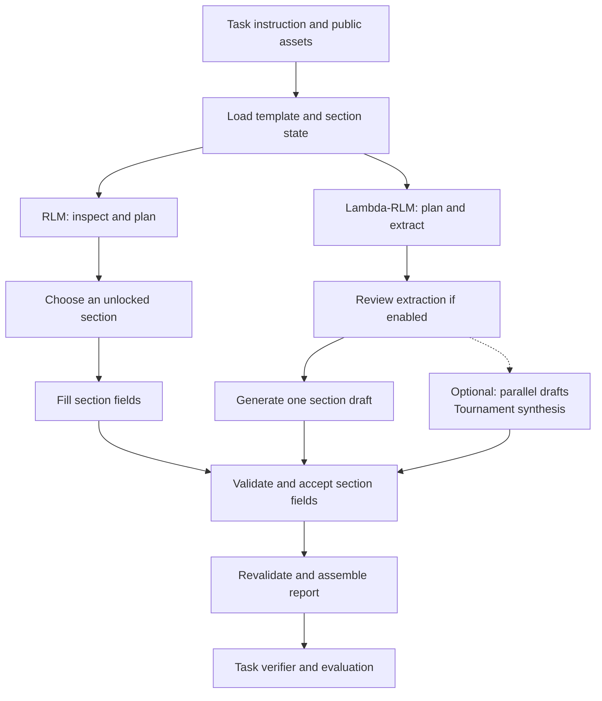

RLM and Lambda-RLM support tasks that need more than one pass over their inputs. RLM lets the model inspect documents and calculate in a persistent Python REPL. Lambda-RLM follows a planned extraction and report-generation workflow. Both use the normal task, execution, verifier, and trial-record boundaries.

For reports, the two harnesses share templates, public writing checks, section state, rubric guidance, and output assembly. The task defines what the report must contain. The agent configuration selects how to produce it.

## Choosing a harness

| Harness | How it works | Use it when |
|---------|--------------|-------------|
| **RLM** | The model chooses REPL operations, inspects results, and keeps intermediate values between turns | The next useful step depends on what the agent finds |
| **Lambda-RLM** | The harness plans extraction, reviews findings, generates sections, and assembles the report | The output structure and source pack are known before execution |

RLM also supports free-form analysis without a report template. Lambda-RLM suits reports, scopes, compliance summaries, and other documents with declared sections. See [Agent Harnesses](/docs/agents/harnesses) for comparison with the other execution strategies.

## Inspecting context with RLM

The REPL holds full Python values while the conversation receives selected results. An agent can load a document once, inspect its length, search for a term, and read the relevant passage without printing the whole document on each turn.

For a report with a declared `inspection` source, a typical sequence is:

```python
source = READ("inspection")
print(len(source))
print(source[:200])
print(grep(source, r"count|items", context=2))
NOTE("inspection_excerpt", source[:200])
```

`grep(text, pattern, context=3)` accepts keywords or regular expressions and returns line numbers with surrounding lines. Python slices provide direct peeking into longer values. `SHOW_VARS()` lists retained variables; `NOTE()` and `RECALL()` keep named working notes. Declared subcalls let the agent delegate bounded model work, while `parallel()` runs independent operations within the worker limit.

Large results are displayed as metadata, a head preview, or a tail preview. These previews do not replace the original Python values. Search has a separate display threshold. Stdout capture stops at one million characters per stream; the result distinguishes capture overflow from display truncation and retains the full written-character count. Error displays are also bounded.

### Compaction

`execution.context_limit` sets the input-context budget. Its default is 128,000 tokens; set it for the selected model. Compaction starts at `compaction_threshold_pct`, while `hard_ceiling_pct` sets the later stop boundary. The runtime requires:

```text
0 < compaction_threshold_pct < hard_ceiling_pct <= 1
```

Compaction preserves task instructions, system policy, report state, command bindings, and configured persistent data. Summary requests and returned summaries are bounded. If context crosses the threshold again immediately, the run stops instead of repeatedly summarising without progress. [Fixed constitutional parameters](#advisor-and-constitution) control previews and state preservation.

## Report assets

A report task stages its template and permitted evidence in the actor workspace. An `rlm.toml` or `lambda-rlm.toml` file can declare:

```toml
[template]
definition = "report_template.toml"
source_mapping = "sources.toml"
validation_rules = "checks.toml"
```

The assets have separate roles:

| Asset | What it declares |
|-------|------------------|
| Task instruction | The objective, required output, and constraints |
| Report template | Section IDs, titles, fields, dependencies, writing guidance, source priorities, and optional composition blocks |
| Source mapping | Public source IDs, file paths, and section source assignments |
| Writing rules | Public pattern checks, warnings, and prose requirements |
| Public rubric | Quality dimensions, weights, criteria, and their section and reference scope |

Template paths resolve relative to the harness configuration file, or the workspace when configuration comes only from an experiment condition. Source mappings, writing rules, and explicit boilerplate paths resolve relative to the template. Resolved paths must stay within the actor workspace, including through symlinks. See the [configuration reference](/docs/reference/config#report-assets) for the file contracts.

A section can depend on accepted content from earlier sections. For example, an inspection summary can depend on the findings section. Independent sections can be filled in parallel. Compose sections can combine verbatim, source-filled, and generated blocks; their traces retain how the content was assembled.

Loading rejects duplicate section IDs, missing or cyclic dependencies, invalid fields, unknown keys, and unknown source references. Explicit source mappings make source authority clear. Without one, the loader can discover supported text files in the staged `documents/` directory.

## A report run

Each attempt uses one of these paths. They share section validation and submission. Lambda-RLM can replace single-draft generation with parallel drafts and synthesis.

<div className="my-6 overflow-x-auto" role="img" aria-label="Report workflow: RLM inspects and fills sections; Lambda-RLM extracts, reviews, and drafts, with optional candidate synthesis. Both validate and assemble the report before task verification." tabIndex={0}>



</div>

Section work repeats until the report is ready or a run limit stops execution. A rejected fill preserves the previous accepted content. Replacing an accepted section invalidates its filled transitive dependants, so a changed finding cannot leave an accepted summary based on the earlier value. Parallel results are accepted in template order.

Lambda-RLM can retry extraction gaps, supplement section evidence, and check generated structure within configured limits. Its task instruction and external system policy reach each model phase, including review, advice, and synthesis. Guided RLM receives the instruction and system policy as it chooses its own next operation.

## Guided report tools

With a template loaded and `execution.scaffolding = true`, RLM receives the report commands below. They are built into the harness and need no task-owned Python command module.

| Command | Purpose |
|---------|---------|
| `HELP()` | Inspect enabled commands and their use |
| `DOCS()`, `READ(source_id)` | List declared source IDs and load source text |
| `STATUS()` | Inspect completed, pending, unlocked, and blocked sections |
| `START(section_id)` | Get fields, guidance, dependency context, rules, public rubric criteria, and source IDs |
| `GUIDANCE(section_id)` | Read the section's writing guidance |
| `CONTEXT(section_id)` | Read accepted dependency content |
| `RULES(section_id)` | Inspect applicable public writing rules |
| `VALIDATE(section_id, fields)` | Check proposed fields without changing accepted state |
| `FILL(section_id, fields)` | Validate and accept fields, or return a typed failure |
| `SUBMIT()` | Assemble the output and return completeness and diagnostics |

`fill_parallel()` uses the same section state and validation as `FILL()`. Task extensions cannot replace protected report commands. Lambda-RLM performs these report operations through its pipeline rather than exposing the guided REPL interface.

## Rubric and review

A rubric marked `visibility = "public"` supplies drafting guidance. Each dimension retains its ID, weight, maximum score, expert persona, and criteria classified as `essential`, `important`, or `optional`. Dimensions can apply to several sections. Empty `eval_sections` applies a dimension to all sections.

Reference scope starts with the already-permitted source pack. Empty `eval_references` includes that pack; explicit selectors use substring matching and each must match a permitted reference. A failed selector produces an error rather than widening access.

Guided RLM receives the applicable criteria in `START()`. Lambda-RLM uses them in drafting, review, and synthesis. A report can also run without a public rubric; section guidance and writing rules still apply.

Lambda-RLM review can run always, on uncertainty, on candidate inconsistency, on both signals, or never. Consistency-based triggers require multiple extraction samples. Retry and supplement limits bound the work. When review is enabled, a final report review also checks public criteria across sections. See [extraction review configuration](/docs/agents/configuration#lambda-rlm-extraction-review).

Required fields, field types, error-level writing rules, and unresolved structural checks can block completion. Warnings and grounding findings remain advisory. Prose rules that cannot be checked deterministically remain `unchecked`. Model reviews retain findings and evidence; they do not award benchmark reward. The [task verifier and evaluation](/docs/evaluation/scoring#public-report-rubrics) own that result.

## Optional candidates and synthesis

There are three different candidate controls:

| Control | Unit of work | Purpose |
|---------|--------------|---------|
| `extract.k_candidates` | Lambda-RLM extraction samples | Compare extracted facts and estimate consistency |
| `fill_section.k_candidates` | Lambda-RLM section drafts | Produce alternatives and synthesise one section |
| CLI `--best-of` | Isolated whole attempts | Select one attempt before the official verifier runs |

Section generation uses one draft by default. Larger K requires `tournament_mode = "synthesis"`. The optional tournament box in the diagram represents parallel drafts followed by synthesis using public criteria and permitted references. It does not use hidden verifier scores. The synthesiser may combine supported content from the drafts rather than select one unchanged.

Use `apply_to_sections` to limit this work to selected sections. Temperature, worker count, synthesiser model, and synthesis input/output limits are explicit. Only `synthesis_mode = "plain"` is supported in this pipeline. See [section candidate configuration](/docs/reference/config#section-candidates).

## Advisor and constitution

An [advisor](/docs/advanced/advisor) answers focused questions during the same trial. Guided RLM exposes `ADVISOR()` when advice is enabled. Lambda-RLM requests advice when review retries leave gaps. Disabled or exhausted advice makes no model call. Advice is guidance, not source evidence or permission to change the task.

Fixed constitutional parameters control harness behaviour:

| Principle | RLM | Lambda-RLM |
|-----------|-----|------------|
| Information minimality | Output thresholds and metadata, head, or tail previews | Bounded information previews |
| State persistence | Variable and scratchpad preservation during compaction | No REPL state-persistence setting |
| Progress obligation | Progress nudges and stall thresholds | No REPL progress setting |
| Source fidelity | Source tracing and gap framing in prompts | Source tracing and gap framing in generation |
| Earned autonomy | Initial scaffolding mode | No REPL autonomy setting |

Declare these parameters inline or in a constitution file. Unsupported parameter tables fail validation. The initial autonomy mode does not imply automatic promotion during a run. Constitutional model inference is unsupported for report execution. See [fixed constitutional parameters](/docs/reference/config#fixed-constitutional-parameters) for the different inline forms.

## Budgets and completion

All main and secondary model work counts towards run usage, including extraction, retries, review, section candidates, synthesis, advice, subcalls, and compaction. `guardrails.token_budget` stops new requests once reported usage reaches the limit. Already admitted parallel calls finish and count towards actual usage, so this is an observed stop limit rather than an exact prepaid cap.

Host request limits can tighten the configured limits. A per-call output setting cannot raise the provider client's maximum. RLM `max_turns` limits main iterations; Lambda-RLM `max_turns` limits model calls. [Configuration](/docs/agents/configuration#report-configuration-precedence) explains how condition values and authored defaults combine.

`SUBMIT()` revalidates accepted sections and writes the requested output. Supported report formats are `markdown`, `json`, `jsonl`, and `markdown_final_fenced_json`. JSON contains a section-ID map; JSONL contains ordered `section_id` and `fields` records. Markdown uses numbered section headings, and the fenced format ends with the section map.

Completion requires the output bytes to match the accepted report state. Missing sections, failed required checks, unresolved structural failures, provider errors, and exhausted limits produce a partial result with diagnostics. A file by itself is insufficient. Unknown provider usage remains unknown.

For guided reports with an explicit output-commitment contract, `COMMIT_OUTPUT()` is an additional step after `SUBMIT()`. Free-form RLM keeps `FINAL` and `FINAL_VAR`. Lambda-RLM submits automatically and rejects explicit commitment contracts. See [Contracts](/docs/core/contracts#agentoutput--what-came-back) and [Traces](/docs/evaluation/traces#report-harness-evidence).

## Synthetic inspection example

The public [synthetic inspection task](https://github.com/TheodoreGalanos/aec-bench/tree/main/tasks/civil/report/synthetic-inspection) contains a source document, a two-section template, writing checks, a weighted public rubric, and an independent verifier. All evidence is synthetic.

Its staged workspace contains:

```text
workspace/
├── rlm.toml
├── lambda-rlm.toml
├── report_template.toml
├── sources.toml
├── checks.toml
└── documents/
    └── inspection.txt
```

The findings section records the observed count. The summary depends on those findings. The rubric weights evidence twice as much as concise presentation and includes essential, important, and optional criteria.

From an `aec-bench` source checkout with [local execution dependencies and provider credentials](/docs/start/installation), select either harness:

```bash
uv run aec-bench run-local tasks/civil/report/synthetic-inspection \
  --harness rlm \
  --model "$REPORT_MODEL"

uv run aec-bench run-local tasks/civil/report/synthetic-inspection \
  --harness lambda-rlm \
  --model "$REPORT_MODEL"
```

Set `REPORT_MODEL` to a model available through your configured provider. Each command starts a separate model-backed run. The task has separate compatible configuration files for the two harnesses.

Inside the guided REPL, the section sequence can be:

```python
START("findings")
READ("inspection")
FILL("findings", {"text": "inspection recorded 12 items."})
START("summary")
FILL("summary", {"text": "inspection recorded 12 items."})
SUBMIT()
```

The submitted JSON has `findings` and `summary` objects, each with a `text` field. Passing the public checks does not establish the score: a report could contain the required count and still add an unsupported claim. The independent verifier checks the submitted artefact.

The library also provides a deterministic replay check for both execution drivers:

```bash
uv run pytest tests/templates/test_report_example.py -q
```

That check exercises task staging, report execution, and independent scoring without calling a model provider. It does not measure model quality or hosted performance.

## Visibility and isolation

Only public rubric content is exposed by the report loader. Private verifier inputs, hidden criteria, gold answers, and other attempts' outputs must stay outside the actor workspace and actor model requests.

The Python REPL can read its workspace. A source index limits declared report access but is not a filesystem security sandbox. Use the execution environment to enforce isolation, and stage only permitted material. Lambda-RLM's document sandbox supports bounded source and anchor access; `sandbox.tool_use = true` is rejected because this pipeline has no model tool execution loop.

The library's [report harness protocol](https://github.com/TheodoreGalanos/aec-bench/blob/main/docs/protocols/report-agent-harness.md) defines the shared validation and completion boundary.
