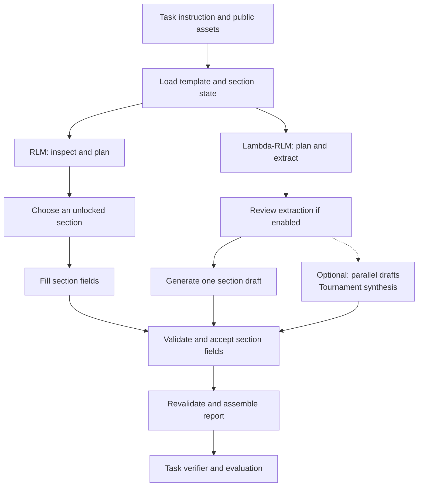

RLM and Lambda-RLM support tasks that need more than one pass over their inputs. RLM lets the model inspect documents and calculate in a persistent Python REPL. Lambda-RLM follows a planned extraction and report-generation workflow. Both use the normal task, execution, verifier, and trial-record boundaries.

For reports, the two harnesses share templates, public writing checks, section state, rubric guidance, and output assembly. The task defines what the report must contain. The agent configuration selects how to produce it.

## Choosing a harness

| Harness | How it works | Use it when |
|---------|--------------|-------------|
| **RLM** | The model chooses REPL operations, inspects results, and keeps intermediate values between turns | The next useful step depends on what the agent finds |
| **Lambda-RLM** | The harness plans extraction, reviews findings, generates sections, and assembles the report | The output structure and source pack are known before execution |

RLM also supports free-form analysis. Lambda-RLM suits reports, scopes, compliance summaries, and other documents with declared sections. See [Agent Harnesses](/docs/agents/harnesses) for comparison with the other execution strategies.

## Inspecting context with RLM

The REPL holds full Python values while the conversation receives selected results. An agent can load a document once, inspect its length, search for a term, and return the relevant passage to the conversation.

For a report with a declared `inspection` source, a typical sequence is:

```python
source = READ("inspection")
print(len(source))
print(source[:200])
print(grep(source, r"count|items", context=2))
NOTE("inspection_excerpt", source[:200])
```

`grep(text, pattern, context=3)` accepts keywords or regular expressions and returns line numbers with surrounding lines. Python slices provide direct peeking into longer values. `SHOW_VARS()` lists retained variables; `NOTE()` and `RECALL()` keep named working notes. Declared subcalls let the agent delegate bounded model work, while `parallel()` runs independent operations within the worker limit.

Large results appear as metadata or a head or tail preview, while the full Python values remain available in the REPL for further inspection. Search has its own display threshold, and error displays are bounded.

Stdout capture stops at one million characters per stream. The result identifies capture overflow separately from a shortened display and retains the full written-character count.

### Compaction

`execution.context_limit` sets the input-context budget. Its default is 128,000 tokens; set it for the selected model. Compaction starts at `compaction_threshold_pct`, while `hard_ceiling_pct` sets the later stop boundary. The runtime requires:

```text
0 < compaction_threshold_pct < hard_ceiling_pct <= 1
```

Compaction preserves task instructions, system policy, report state, command bindings, and configured persistent data. Summary requests and returned summaries are bounded. If context crosses the threshold again immediately, the run stops with its retained progress and diagnostics. [Fixed constitutional parameters](#advisor-and-constitution) control previews and state preservation.

## Report assets

A report task stages its template and permitted evidence in the actor workspace. An `rlm.toml` or `lambda-rlm.toml` file can declare:

```toml
[template]
definition = "report_template.toml"
source_mapping = "sources.toml"
validation_rules = "checks.toml"
```

The assets have separate roles:

| Asset | What it declares |
|-------|------------------|
| Task instruction | The objective, required output, and constraints |
| Report template | Section IDs, titles, fields, dependencies, writing guidance, source priorities, and optional composition blocks |
| Source mapping | Public source IDs, file paths, and section source assignments |
| Writing rules | Public pattern checks, warnings, and prose requirements |
| Public rubric | Quality dimensions, weights, criteria, and their section and reference scope |

Template paths resolve relative to the harness configuration file, or the workspace when configuration comes only from an experiment condition. Source mappings, writing rules, and explicit boilerplate paths resolve relative to the template. Resolved paths must stay within the actor workspace, including through symlinks. See the [configuration reference](/docs/reference/config#report-assets) for the file contracts.

A section can depend on accepted content from earlier sections. For example, an inspection summary can depend on the findings section. Independent sections can be filled in parallel. Compose sections can combine verbatim, source-filled, and generated blocks; their traces retain how the content was assembled.

Loading rejects duplicate section IDs, missing or cyclic dependencies, invalid fields, unknown keys, and unknown source references. Explicit source mappings make source authority clear. By default, the loader discovers supported text files in the staged `documents/` directory.

## A report run

Each attempt uses one of these paths. They share section validation and submission. Lambda-RLM can replace single-draft generation with parallel drafts and synthesis.

<div className="my-6 overflow-x-auto" role="img" aria-label="Report workflow: RLM inspects and fills sections; Lambda-RLM extracts, reviews, and drafts, with optional candidate synthesis. Both validate and assemble the report before task verification." tabIndex={0}>


```mermaid
flowchart TD
    A["Task instruction and public assets"] --> B["Load template and section state"]
    B --> C["RLM: inspect and plan"]
    B --> D["Lambda-RLM: plan and extract"]
    C --> E["Choose an unlocked section"]
    D --> F["Review extraction if enabled"]
    E --> G["Fill section fields"]
    F --> H["Generate one section draft"]
    F -.-> K["Optional: parallel drafts<br/>Tournament synthesis"]
    G --> I["Validate and accept section fields"]
    H --> I
    K --> I
    I --> J["Revalidate and assemble report"]
    J --> L["Task verifier and evaluation"]
```

</div>

Section work repeats until the report is ready or a run limit stops execution. A rejected fill preserves the previous accepted content. Replacing an accepted section invalidates its filled transitive dependants. Parallel results are accepted in template order.

Lambda-RLM can retry extraction gaps, supplement section evidence, and check generated structure within configured limits. Its task instruction and external system policy reach each model phase, including review, advice, and synthesis. Guided RLM receives the instruction and system policy as it chooses its own next operation.

## Guided report tools

With a template loaded and `execution.scaffolding = true`, RLM receives the report commands below.

| Command | Purpose |
|---------|---------|
| `HELP()` | Inspect enabled commands and their use |
| `DOCS()`, `READ(source_id)` | List declared source IDs and load source text |
| `STATUS()` | Inspect completed, pending, unlocked, and blocked sections |
| `START(section_id)` | Get fields, guidance, dependency context, rules, public rubric criteria, and source IDs |
| `GUIDANCE(section_id)` | Read the section's writing guidance |
| `CONTEXT(section_id)` | Read accepted dependency content |
| `RULES(section_id)` | Inspect applicable public writing rules |
| `VALIDATE(section_id, fields)` | Validate proposed fields before acceptance |
| `FILL(section_id, fields)` | Validate and accept fields, or return a typed failure |
| `SUBMIT()` | Assemble the output and return completeness and diagnostics |

`fill_parallel()` uses the same section state and validation as `FILL()`. Lambda-RLM performs these report operations through its pipeline.

## Rubric and review

A rubric marked `visibility = "public"` supplies drafting guidance. Each dimension retains its ID, weight, maximum score, expert persona, and criteria classified as `essential`, `important`, or `optional`. Dimensions can apply to several sections. Empty `eval_sections` applies a dimension to all sections.

Reference scope starts with the already-permitted source pack. Empty `eval_references` includes that pack; explicit selectors use substring matching and each must match a permitted reference.

Public rubric criteria supplement the section guidance and writing rules that apply to every report. Guided RLM receives the applicable criteria in `START()`, while Lambda-RLM uses them throughout drafting, review, and synthesis.

Configure Lambda-RLM's [extraction review trigger](/docs/agents/configuration#lambda-rlm-extraction-review) to choose when review runs. Consistency-based triggers compare multiple extraction samples; retry and supplement limits bound any follow-up work. Enabling review also adds a final check of public criteria across the assembled report.

Completion checks have different effects:

| Check | Effect |
|-------|--------|
| Required fields and field types | Invalid or missing values block completion |
| Error-level writing rules and structural checks | Unresolved failures block completion |
| Warnings and grounding findings | Remain advisory |
| Prose rules that require judgement | Remain `unchecked` by deterministic validation |
| Model review | Retains findings and supporting evidence |

The [task verifier and evaluation](/docs/evaluation/scoring#public-report-rubrics) determine benchmark reward from the submitted artefact.

## Optional candidates and synthesis

There are three different candidate controls:

| Control | Unit of work | Purpose |
|---------|--------------|---------|
| `extract.k_candidates` | Lambda-RLM extraction samples | Compare extracted facts and estimate consistency |
| `fill_section.k_candidates` | Lambda-RLM section drafts | Produce alternatives and synthesise one section |
| CLI `--best-of` | Isolated whole attempts | Select one attempt before the official verifier runs |

Section generation uses one draft by default. Larger K requires `tournament_mode = "synthesis"`. The optional tournament box in the diagram represents parallel drafts followed by synthesis using public criteria and permitted references. The synthesiser can combine supported content from several drafts.

Use `apply_to_sections` to limit this work to selected sections. Temperature, worker count, synthesiser model, and synthesis input/output limits are explicit. Set `synthesis_mode = "plain"`. See [section candidate configuration](/docs/reference/config#section-candidates).

## Advisor and constitution

An [advisor](/docs/advanced/advisor) answers focused questions during the same trial. Guided RLM exposes `ADVISOR()` when advice is enabled. Lambda-RLM requests advice when review retries leave gaps.

Fixed constitutional parameters control harness behaviour:

| Harness | Fixed controls |
|---------|----------------|
| RLM | Output previews, variable and scratchpad preservation, progress nudges, stall thresholds, source tracing, and initial scaffolding mode |
| Lambda-RLM | Bounded information previews, source tracing, and gap framing |

Declare fixed parameters inline or in a constitution file. Choose the settings supported by the selected harness. See [fixed constitutional parameters](/docs/reference/config#fixed-constitutional-parameters) for the different inline forms.

## Budgets and completion

`guardrails.token_budget` covers all main and secondary model calls throughout the run. Once reported usage reaches the limit, the harness stops new requests. Calls already running in parallel finish and count towards actual usage, which can therefore exceed the stop limit.

Host request limits can tighten the configured limits. Per-call output limits are capped by the provider client's maximum. RLM `max_turns` limits main iterations; Lambda-RLM `max_turns` limits model calls. [Configuration](/docs/agents/configuration#report-configuration-precedence) explains how condition values and authored defaults combine.

`SUBMIT()` revalidates accepted sections and writes the requested output format:

| Format | Output structure |
|--------|------------------|
| `markdown` | Numbered section headings |
| `json` | A section-ID map |
| `jsonl` | Ordered `section_id` and `fields` records |
| `markdown_final_fenced_json` | Markdown ending with the section map in a fenced JSON block |

Completion requires the output bytes to match the accepted report state. Missing sections, failed required checks, unresolved structural failures, provider errors, and exhausted limits produce a partial result with diagnostics. Unknown provider usage remains unknown.

For guided reports with an explicit output-commitment contract, `COMMIT_OUTPUT()` is an additional step after `SUBMIT()`. Free-form RLM keeps `FINAL` and `FINAL_VAR`. Lambda-RLM submits automatically. See [Contracts](/docs/core/contracts#agentoutput--what-came-back) and [Traces](/docs/evaluation/traces#report-harness-evidence).

## Synthetic inspection example

The public [synthetic inspection task](https://github.com/TheodoreGalanos/aec-bench/tree/main/tasks/civil/report/synthetic-inspection) contains a source document, a two-section template, writing checks, a weighted public rubric, and an independent verifier. All evidence is synthetic.

Its staged workspace contains:

```text
workspace/
├── rlm.toml
├── lambda-rlm.toml
├── report_template.toml
├── sources.toml
├── checks.toml
└── documents/
    └── inspection.txt
```

The summary draws on the accepted findings section, which records the observed count. The rubric weights evidence twice as much as concise presentation and groups its criteria by importance.

From an `aec-bench` source checkout with [local execution dependencies and provider credentials](/docs/start/installation), select either harness:

```bash
uv run aec-bench run-local tasks/civil/report/synthetic-inspection \
  --harness rlm \
  --model "$REPORT_MODEL"

uv run aec-bench run-local tasks/civil/report/synthetic-inspection \
  --harness lambda-rlm \
  --model "$REPORT_MODEL"
```

Set `REPORT_MODEL` to a model available through your configured provider. Each command starts a separate model-backed run. The task has separate compatible configuration files for the two harnesses.

Inside the guided REPL, the section sequence can be:

```python
START("findings")
READ("inspection")
FILL("findings", {"text": "inspection recorded 12 items."})
START("summary")
FILL("summary", {"text": "inspection recorded 12 items."})
SUBMIT()
```

The submitted JSON has `findings` and `summary` objects, each with a `text` field. The independent verifier checks the submitted artefact.

The library also provides a deterministic replay check for both execution drivers:

```bash
uv run pytest tests/templates/test_report_example.py -q
```

The replay check exercises task staging, report execution, and independent scoring with deterministic model responses.

## Visibility and isolation

Only public rubric content is exposed by the report loader. Private verifier inputs, hidden criteria, gold answers, and other attempts' outputs must stay outside the actor workspace and actor model requests.

The Python REPL can read its workspace. The source index controls which documents report tools expose. Use the execution environment to enforce isolation, and stage only permitted material. Lambda-RLM's document sandbox supports bounded source and anchor access.

The library's [report harness protocol](https://github.com/TheodoreGalanos/aec-bench/blob/main/docs/protocols/report-agent-harness.md) defines the shared validation and completion boundary.
